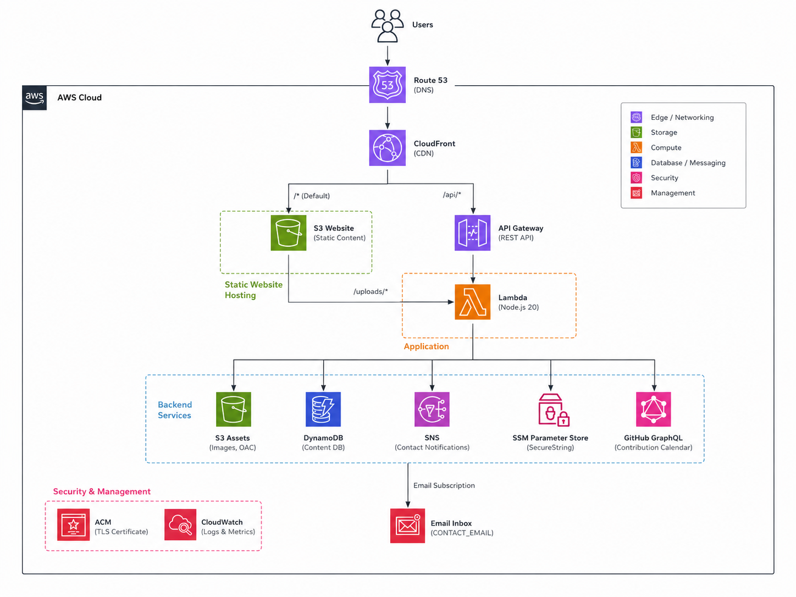

# Portfolio Website

> **Fully serverless AWS portfolio platform with an integrated CMS — edit your site live from the browser, no separate admin panel.**

## About

Personal portfolio and content platform for developers who want a polished public site they can maintain themselves. React/Vite frontend on CloudFront + S3; Node.js Lambda behind API Gateway for content, uploads, contact, and GitHub data. DynamoDB stores JSON documents; assets go to S3 via presigned URLs. Editor mode unlocks through IP detection at the CloudFront edge — no login, write access restricted to trusted IPs. Infrastructure is AWS CDK (TypeScript); CI/CD via GitHub Actions (`dev` / `prod`).

**Live demo:** [mantasec.dev](https://mantasec.dev)

## Architecture



Route 53 and ACM terminate TLS at CloudFront, which routes static assets to S3, API calls to Lambda via API Gateway, uploads to the assets bucket, and contact notifications through SNS. Secrets live in SSM Parameter Store.

### AWS Services

| Service | Role |
|---|---|
| **Route 53** | DNS — custom domain → CloudFront |
| **ACM** | TLS certificates for HTTPS |
| **CloudFront** | CDN — SPA, `/api/*`, `/uploads/*` |
| **CloudFront Functions** | Edge IP check → `x-editor-allowed` header |
| **S3** | Website bucket + assets bucket (private, OAC) |
| **API Gateway** | REST proxy to Lambda |
| **Lambda** | Content CRUD, uploads, contact, GitHub GraphQL |
| **DynamoDB** | Content + settings JSON (`pk`/`sk`) |
| **SNS** | Contact-form email notifications |
| **SSM** | GitHub PAT (`SecureString`) |
| **CloudWatch** | Logs and metrics |

See [Architecture Decisions](#architecture-decisions) below for rationale (DynamoDB vs RDS, CloudFront Functions vs Cognito, etc.).

### Request Flow

| Step | Path |
|---|---|
| Page load | Browser → CloudFront → S3 (static) → `GET /api/settings` + `GET /api/content` |
| Read content | CloudFront `/api/*` → Lambda → DynamoDB `GetItem` |
| Editor save | `PUT /api/content` — Lambda checks `x-editor-allowed` → DynamoDB `PutItem` |
| Upload | `POST /api/upload` → presigned S3 PUT → URL in content JSON |
| Contact | `POST /api/contact` → SNS → email (honeypot + rate limit) |
| GitHub | `GET /api/github-contributions` → SSM PAT → GraphQL (1 h cache) |

Full diagrams and flows: [Security](docs/SECURITY.md) · [API](docs/API.md)

## Architecture Decisions

**DynamoDB instead of RDS** — Single JSON document per stage (hero + sections + settings); no joins. On-demand billing, no always-on instance.

**CloudFront Functions instead of Cognito** — One editor, no user accounts. IP allowlist at the edge sets a trusted header; Lambda enforces writes. IPv6 `/64` prefix matching for home networks.

**Single Lambda** — All routes share IAM role and deployment lifecycle; matches low traffic of a personal portfolio.

**S3 + CloudFront for frontend** — Static Vite build; cheapest global SPA hosting. Lambda only for dynamic API.

**SNS for contact form** — No third-party form service; honeypot, timing, and rate limits in Lambda.

## Tech Stack

| Layer | Technologies |
|---|---|
| Frontend | React 19, Vite, TypeScript, Tailwind CSS v4, shadcn/ui |
| Backend | AWS Lambda (Node.js 20), API Gateway |
| Data | DynamoDB, S3 |
| Edge | CloudFront, CloudFront Functions, Route 53, ACM |
| Infrastructure | AWS CDK (TypeScript) |
| CI/CD | GitHub Actions — tests, SSM sync, CDK deploy, S3 sync, invalidation |

## Repository Structure

```
portfolio-website/
├── frontend/           # React/Vite SPA + inline Portfolio Builder
├── backend/lambda/     # Single Lambda handler (all /api/* routes)
├── infrastructure/     # AWS CDK stack
├── docs/               # Detailed documentation + architecture images
├── .github/workflows/  # deploy-dev.yml, deploy-prod.yml
└── README.md
```

| Path | Purpose |
|---|---|
| `frontend/src/api/` | Fetch wrappers — `local` vs `api` data mode |
| `frontend/src/components/Builder/` | Inline CMS — editors + live preview |
| `frontend/src/components/Sections/` | Public section renderers |
| `infrastructure/lib/` | CDK stack definition |

## Features

| Feature | What it does |
|---|---|
| **Portfolio Builder** | 40/60 editor + live preview; Edit button when `editor.allowed === true` |
| **Seven section types** | `timeline`, `text`, `image`, `skills`, `insights`, `github`, `contact` |
| **Runtime theming** | Theme, colours, Google Font via CSS variables — no rebuild |
| **EN/DE content** | `_en` / `_de` field variants + language switcher |
| **GitHub heatmap** | Server-side contribution calendar (PAT in SSM) |
| **Contact form** | SNS email delivery; anti-spam in Lambda |
| **Local dev mode** | `VITE_DATA_MODE=local` → `localStorage`, no AWS needed |

## CMS Overview

No separate admin URL — edit the live site from an allowlisted IP.

| Action | API | Storage |
|---|---|---|
| Save hero + sections | `PUT /api/content` | DynamoDB `CONTENT` / `MAIN` |
| Save settings | `PUT /api/settings` | DynamoDB `SETTINGS` / `MAIN` |
| Upload image | `POST /api/upload` → S3 PUT | URL string in content JSON |

Section types, field schemas, and full API specs: **[docs/API.md](docs/API.md)**

## Security Overview


IP-based edge auth — no login, no JWT, no Cognito. CloudFront Function sets `x-editor-allowed` on every request; Lambda returns `403` on write routes without it. GitHub PAT in SSM; S3 buckets private behind OAC.

Full details — edge-auth flow, SSM, IAM least-privilege, do-not-commit list: **[docs/SECURITY.md](docs/SECURITY.md)**

## API Summary

| Method | Path | Auth |
|---|---|---|
| `GET` | `/api/content` | Public |
| `PUT` | `/api/content` | Editor |
| `GET` | `/api/settings` | Public |
| `PUT` | `/api/settings` | Editor |
| `POST` | `/api/upload` | Editor |
| `GET` | `/api/github-contributions` | Public |
| `POST` | `/api/contact` | Public (rate-limited) |

Request/response bodies, DynamoDB schema, error codes: **[docs/API.md](docs/API.md)**

## Quick Start

### Local frontend (no AWS)

```bash
git clone https://github.com/eecmon/portfolio-website.git
cd portfolio-website/frontend
npm ci
echo 'VITE_DATA_MODE=local' > .env.local
npm run dev
```

### Deploy to AWS

```bash
cp infrastructure/config/stages.example.ts infrastructure/config/stages.ts
# edit stages.ts, then:
export CDK_DEFAULT_REGION=eu-central-1
export CONTACT_EMAIL="you@example.com"
export ADMIN_ALLOWED_IPS="$(curl -s https://checkip.amazonaws.com)"

cd infrastructure && npm ci && npm run build
npx cdk bootstrap aws://$(aws sts get-caller-identity --query Account --output text)/eu-central-1
npx cdk deploy --require-approval never -c stage=dev --outputs-file cdk-outputs.json
```

Full prerequisites, env vars, 13-step guide: **[docs/SETUP.md](docs/SETUP.md)**

### Run tests

```bash
cd frontend && npx vitest run
cd ../backend && npm test
```

## Documentation

| Document | Contents |
|---|---|
| [docs/SETUP.md](docs/SETUP.md) | Prerequisites, env vars, SSM, AWS account, step-by-step setup |
| [docs/DEPLOYMENT.md](docs/DEPLOYMENT.md) | CI/CD workflows, GitHub Secrets, OIDC, manual `cdk deploy` |
| [docs/API.md](docs/API.md) | DynamoDB schema, API endpoints, request/response examples |
| [docs/SECURITY.md](docs/SECURITY.md) | Edge-auth, SSM, IAM, secrets hygiene |

## License

MIT License — Copyright (c) 2026 [eecmon](https://github.com/eecmon). See [LICENSE](LICENSE) for the full text.
