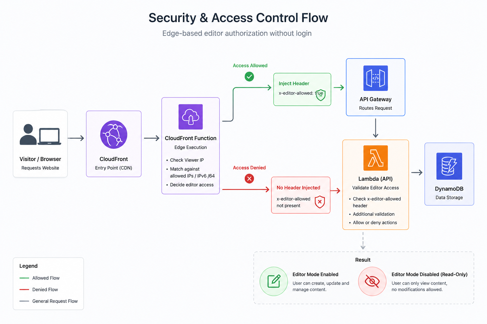

# Security

## Security Model

Authentication is IP-based at the CloudFront edge — there is no login form, no JWT, and no Cognito user pool. The diagram below shows the full authorization flow from browser to DynamoDB.



### Edge-Auth with CloudFront Functions

Editor access is decided **before the request reaches the backend**. A CloudFront Function runs on the `viewer-request` event for both the default behavior (`/*` → S3) and the API behavior (`/api/*` → API Gateway).

#### How it works

```
Browser request
      │
      ▼
CloudFront edge location
      │
      ▼
CloudFront Function (JavaScript, sub-ms, no cold start)
  1. Read event.viewer.ip
  2. Compare against allowlist baked in at deploy time (ADMIN_ALLOWED_IPS)
  3. Set headers on the outgoing request:
       x-editor-allowed: "true" | "false"
       x-viewer-ip:       "<client IP>"
      │
      ├── Static path (/*)          → S3 origin (headers not forwarded to S3)
      └── API path (/api/*)         → API Gateway → Lambda
                                        Origin request policy forwards only
                                        x-editor-allowed and x-viewer-ip
```

#### IP matching rules

| IP type | Match logic | Example |
|---|---|---|
| **IPv4** | Case-insensitive exact string match | Allowlist `203.0.113.10` matches viewer `203.0.113.10` |
| **IPv6** | First four colon-separated groups (`/64` prefix) | Allowlist `2001:db8:1234:5678::1` matches any address starting with `2001:db8:1234:5678:` — needed because privacy extensions rotate the lower 64 bits on every connection |

The allowlist is compiled into the function source at **CDK deploy time** via `JSON.stringify(props.adminAllowedIps)`. Changing IPs requires updating `ADMIN_ALLOWED_IPS` and redeploying the stack.

#### Why headers, not cookies or JWTs

| Property | Detail |
|---|---|
| **Not forgeable by the browser** | CloudFront sets `x-editor-allowed` at the edge. Browsers cannot add this header to cross-origin requests in a way that bypasses CloudFront. |
| **No session state** | No token storage, expiry, refresh, or logout flow. |
| **Runs on every request** | Static page loads and API calls both pass through the function — the frontend learns `editor.allowed` from `GET /api/content`. |
| **Always set** | Even denied visitors get `x-editor-allowed: false` — Lambda never has to guess. |

#### Frontend vs backend responsibility

| Layer | Role |
|---|---|
| **CloudFront Function** | Authoritative IP check; sets trusted headers |
| **Lambda** | Enforces headers on write routes — returns `403` if `x-editor-allowed !== 'true'` |
| **React frontend** | Reads `editor.allowed` from API response to show/hide the Edit button — **UI only, not a security boundary** |

#### Protected and public routes

| Route | Editor required? | Behaviour without editor access |
|---|---|---|
| `GET /api/content`, `GET /api/settings`, `GET /api/github-contributions` | No | Public read |
| `PUT /api/content`, `PUT /api/settings`, `POST /api/upload` | Yes | `403 Forbidden` |
| `POST /api/contact` | No | Public submit with honeypot, timing, and rate limits |

#### Debug editor access

```bash
curl https://mantasec.dev/api/content | jq .editor
# → { "allowed": true, "viewerIp": "203.0.113.10" }
```

Compare `viewerIp` against `ADMIN_ALLOWED_IPS` if the Edit button is missing.

#### Limitations

IP-based auth assumes a stable home/office IP (or IPv6 `/64` prefix). Anyone on the same network segment sharing that prefix could theoretically gain editor access. Suitable for a single-owner personal site — not for multi-tenant or high-sensitivity admin panels.

### SSM Parameter Store

Secrets that must not appear in code, git, or Lambda environment variables in plain text are stored in **AWS Systems Manager Parameter Store**.

| Parameter path | Type | Tier | Written by | Read by | Purpose |
|---|---|---|---|---|---|
| `/portfolio/dev/github-token` | `SecureString` | Standard | CI/CD (`aws ssm put-parameter`) or manual CLI | Lambda (`ssm:GetParameter` with decryption) | GitHub PAT for contribution heatmap GraphQL query |
| `/portfolio/prod/github-token` | `SecureString` | Standard | CI/CD or manual CLI | Lambda (`ssm:GetParameter` with decryption) | Same token, production stage |

**What is stored:** a GitHub Personal Access Token with `read:user` scope.

**What is not stored in SSM:** contact email (`CONTACT_EMAIL` goes to CDK/SNS at deploy time), editor IPs (`ADMIN_ALLOWED_IPS` is compiled into the CloudFront Function), or AWS credentials.

**Lambda access pattern:**

```javascript
// backend/lambda/index.js — only fetched when GitHub contributions are requested
ssm.send(new GetParameterCommand({
  Name: GITHUB_TOKEN_PARAM,   // e.g. /portfolio/prod/github-token
  WithDecryption: true,
}));
```

**IAM scope:** Lambda role has `ssm:GetParameter` on exactly one ARN per stage — not `ssm:*` on `*`.

**Rotation:** update `PORTFOLIO_GITHUB_PAT` in GitHub Secrets (or run `aws ssm put-parameter --overwrite` manually). No code redeploy needed — Lambda reads the latest value on cache miss.

### IAM — Least Privilege

Each principal gets only the permissions it needs.

#### Lambda execution role (`ApiLambda`)

Created by CDK. Scoped grants — no blanket `AdministratorAccess`.

| Permission | Scope | Why |
|---|---|---|
| `dynamodb:GetItem`, `PutItem`, … | Table `portfolio-content-{stage}` only | Read/write content and settings records |
| `s3:GetObject`, `PutObject`, … | Assets bucket `portfolio-assets-{stage}-*` only | Presigned uploads and asset serving |
| `sns:Publish` | Contact topic `portfolio-contact-{stage}` only | Send contact-form emails |
| `ssm:GetParameter` | `arn:...:parameter/portfolio/{stage}/github-token` only | Fetch GitHub PAT at runtime |
| `logs:CreateLogGroup`, `CreateLogStream`, `PutLogEvents` | Lambda log group (CDK default) | CloudWatch logging |

The Lambda role **cannot**: read other SSM parameters, write to the website bucket, publish to other SNS topics, or access other DynamoDB tables.

#### GitHub Actions OIDC role (`AWS_DEPLOY_ROLE_ARN`)

Used only during CI/CD deploy jobs. Trust policy restricts assumption to this repository via `token.actions.githubusercontent.com`.

| Capability | Used for |
|---|---|
| CloudFormation / CDK deploy | Create and update stack resources |
| `ssm:PutParameter` | Sync GitHub PAT to Parameter Store |
| `s3:PutObject`, `DeleteObject`, `ListBucket` | Frontend sync to website bucket |
| `cloudfront:CreateInvalidation` | Cache bust after deploy |

**Recommended:** scope the OIDC role to the minimum actions above rather than `AdministratorAccess`. See [Deployment — OIDC setup](DEPLOYMENT.md#aws-oidc-setup-one-time) for the simplest first-time setup — tighten the policy once the stack is stable.

#### Human deployer (manual `cdk deploy`)

Uses your local AWS CLI profile. Needs CloudFormation, IAM pass-role, and resource-create permissions for all stack components. Prefer a dedicated deploy user or role over root account credentials.

#### S3 buckets

Both buckets use `blockPublicAccess: BLOCK_ALL`. No public ACLs or bucket policies granting `Principal: "*"`. Access is exclusively through CloudFront Origin Access Control (OAC).

### Do not commit

The following must **never** appear in git, pull requests, or public issue comments:

| File / value | Why | Where it belongs instead |
|---|---|---|
| `frontend/.env.local` | May contain `VITE_DATA_MODE=api` pointing at live infra | Local disk only — matched by `.env.*.local` in `.gitignore` |
| `.env`, `.env.*.local` | Environment-specific config and secrets | Local disk or CI secret store |
| `infrastructure/config/stages.ts` | Contains real email, home IPs, domain config | Gitignored — copy from `stages.example.ts` locally; CI generates from example |
| GitHub PAT (`ghp_…`, `github_pat_…`) | Grants access to your GitHub account | GitHub Secret `PORTFOLIO_GITHUB_PAT` → SSM Parameter Store |
| AWS access keys (`AKIA…`) | Full account access if leaked | OIDC role for CI; `aws configure` / SSO locally |
| `CONTACT_EMAIL` | Personal email address | GitHub Environment secret or shell env var at deploy |
| `ADMIN_ALLOWED_IPS` | Reveals home/office network location | GitHub Environment secret or shell env var at deploy |
| `cdk-outputs.json` | Exposes bucket names, distribution IDs, API URLs | Generated at deploy time, not tracked |
| `cdk.out/`, `.cdk.staging/` | Synthesized CloudFormation may embed account-specific ARNs | Build artifacts — gitignored |
| `node_modules/`, `dist/` | Dependencies and build output | Regenerated by `npm ci` / `npm run build` |

**Safe to commit:** `stages.example.ts` (placeholder values), source code, CDK stack definitions, workflow files (they reference secrets by name, not value).

**If a secret is leaked:** rotate immediately — revoke the GitHub PAT, rotate AWS keys, update GitHub Secrets, and redeploy so the CloudFront Function picks up new IPs if those were exposed.

### Other protections

| Layer | Mechanism |
|---|---|
| **Contact form spam** | Honeypot field (silent discard), minimum 3 s form age, 1 submission per IP per 10 minutes |
| **Upload URLs** | Presigned S3 PUT, 5-minute expiry, editor-gated issuance; filename sanitised server-side |
| **HTTPS** | CloudFront redirects HTTP → HTTPS; ACM certificate on custom domain |
| **CI/CD auth** | GitHub Actions OIDC — no long-lived `AWS_ACCESS_KEY_ID` in repository secrets |
